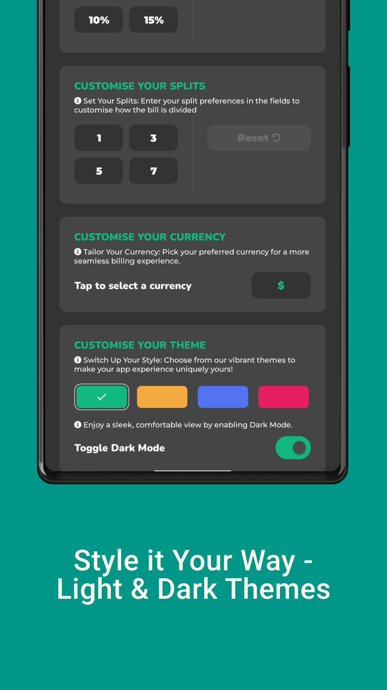
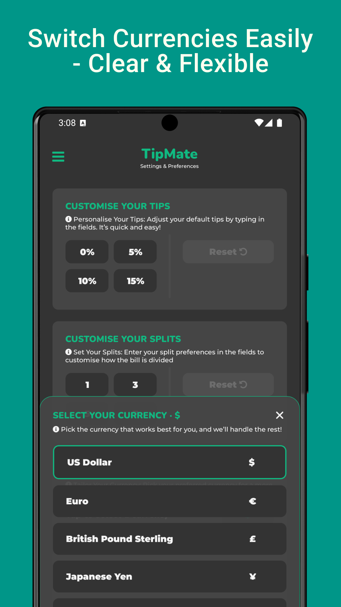

# TipMate - Tip Calculator & Bill Splitting App

<p align="center">
  
</p>

<p align="center">
  <b>Smart Tips - Easy Living</b>
</p>

## Description

TipMate is a fast, reliable tip calculator app for quick gratuity calculations and easy bill splitting. Instantly work out tips, divide expenses among friends, and customize your preferences for stress-free group payments. Built with React Native, TipMate offers a clean, intuitive interface designed to make tipping and bill splitting as effortless as possible.

## Download

<a href="https://play.google.com/store/apps/details?id=com.devinapps.tips.tipcalculator">
  
</a>

## Screenshots

<table>
  <tr>
    <td></td>
    <td></td>
    <td></td>
    <td></td>
  </tr>
</table>

## Features

- **Instant Tip Calculation**: Calculate tips quickly with preset percentages (0%, 5%, 10%, 15%) or custom values
- **Easy Bill Splitting**: Divide the bill between 1 to 7 people or any custom number
- **Rounding Options**: Round up or down for more convenient payment amounts
- **Multi-Currency Support**: Switch between USD, EUR, GBP, JPY, and more with ease
- **Custom Themes**: Choose from vibrant color themes to personalize your experience
- **Dark Mode**: Enjoy a sleek, comfortable viewing experience
- **Customizable Presets**: Save your preferred tip percentages and split options
- **Clean Interface**: Modern, intuitive design for quick and easy use

## Technology Stack

- **Framework**: [React Native](https://reactnative.dev/)
- **Language**: [TypeScript](https://www.typescriptlang.org/)
- **Styling**: [Unistyles](https://www.unistyl.es)
- **State Management**: [React Context API](https://react.dev/learn/passing-data-deeply-with-context)
- **Navigation**: [React Navigation](https://reactnavigation.org/)
- **Storage**: [AsyncStorage](https://react-native-async-storage.github.io/async-storage/)

## Repository

GitHub: [https://github.com/DevinByteX/TipMate-ReactNative](https://github.com/DevinByteX/TipMate-ReactNative)

## Requirements

- Node.js 14.0 or higher
- npm or yarn
- React Native CLI
- Android Studio (for Android development)
- JDK 11

## Installation

```bash
# Clone the repository
git clone https://github.com/DevinByteX/TipMate-ReactNative.git

# Navigate to the project directory
cd TipMate-ReactNative

# Install dependencies
npm install
# or
yarn install
```

## Running the App

### For Android

```bash
# Start Metro Bundler
npx react-native start

# Run on Android
npx react-native run-android
```

### For iOS

```bash
# Install Pod dependencies
cd ios && pod install && cd ..

# Start Metro Bundler
npx react-native start

# Run on iOS
npx react-native run-ios
```

## Project Structure

```
TipMate-ReactNative/
├── android/                # Android native code
├── ios/                    # iOS native code
├── app/
│   ├── assets/             # Images, fonts, etc.
│   ├── components/         # Reusable components
│   ├── configs/             # Configs and Config functions
│   ├── context/            # React Context providers
│   ├── hooks/              # Custom React hooks
│   ├── navigation/         # Navigation configurations
│   ├── plugins/            # Some plugins with custom functions
│   ├── screens/            # Screen components
│   └── styles/             # Unistyles configurations
├── .gitignore
├── package.json
└── README.md
```

## License

This project is licensed under the MIT License - see the LICENSE file for details.
